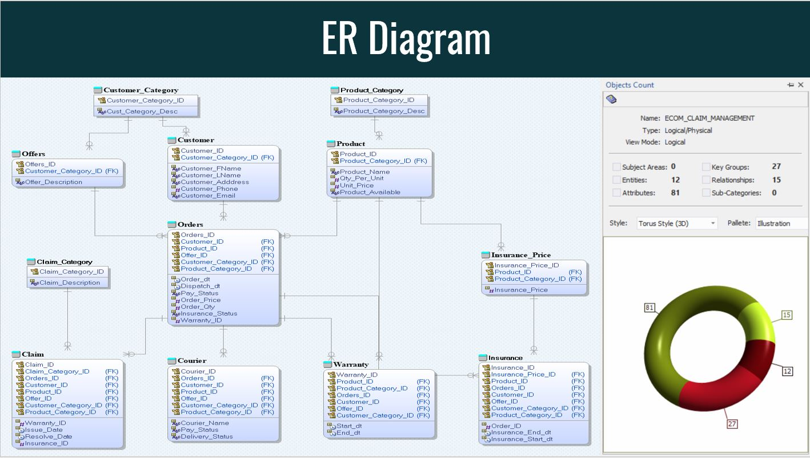
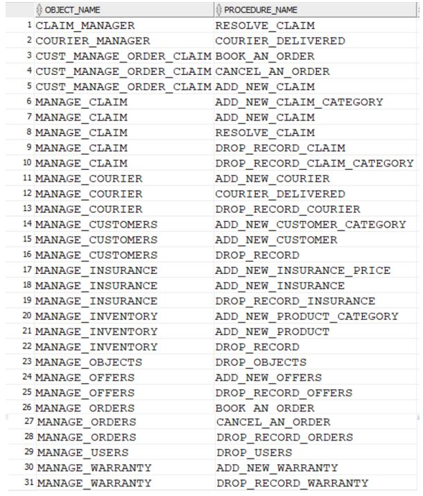

# OLTP_For_Ecommerce_Platform_PLSQL

This repository contains an implementation of an Online Transaction Processing (OLTP) system for an E-commerce platform using PL/SQL. The system utilizes a data model designed for an Oracle database and employs stored procedures and triggers to execute OLTP operations efficiently.

# Introduction
The OLTP system aims to provide robust transactional support for an E-commerce platform, enabling efficient handling of online orders, inventory management, and customer interactions. The implementation utilizes PL/SQL, a procedural extension of SQL, for creating and managing database objects, executing complex operations, and maintaining data integrity through triggers.

# Data Model
The data model employed in this system is designed specifically for an E-commerce platform and consists of several tables representing key entities and their relationships.

# Usage
Various operations can be performed using below stored procedures:

# Roles & Access
- Application_Admin: Has read/insert/update/delete access to all objects in the model
- Customer: Has read access on products, execute on procedure to order/cancel products, execute on procedure to raise/withdraw claims for respective products
- Sales_Manager: Has read access on views(reports)
- Claim_Manager: Has read access on warranty/Insurance tables. execute on procedure to resolve customer claim requests
- Inventory_Manager: has read/insert/update/delete on product table via procedure execution 
